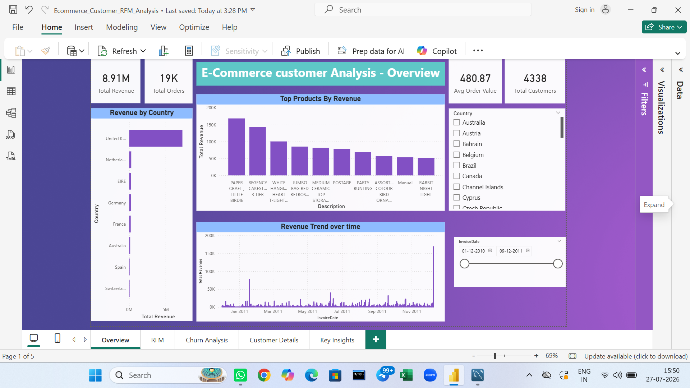
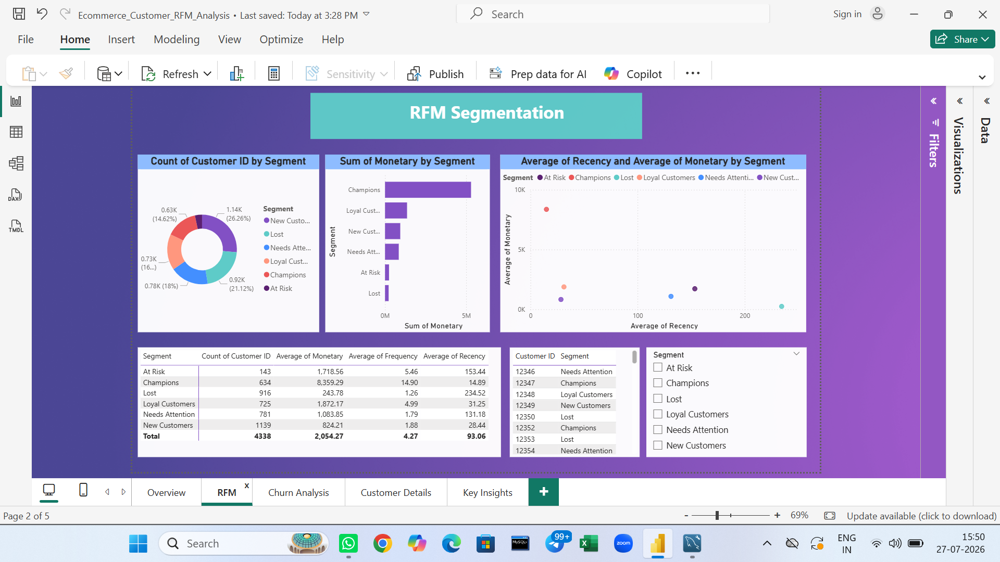
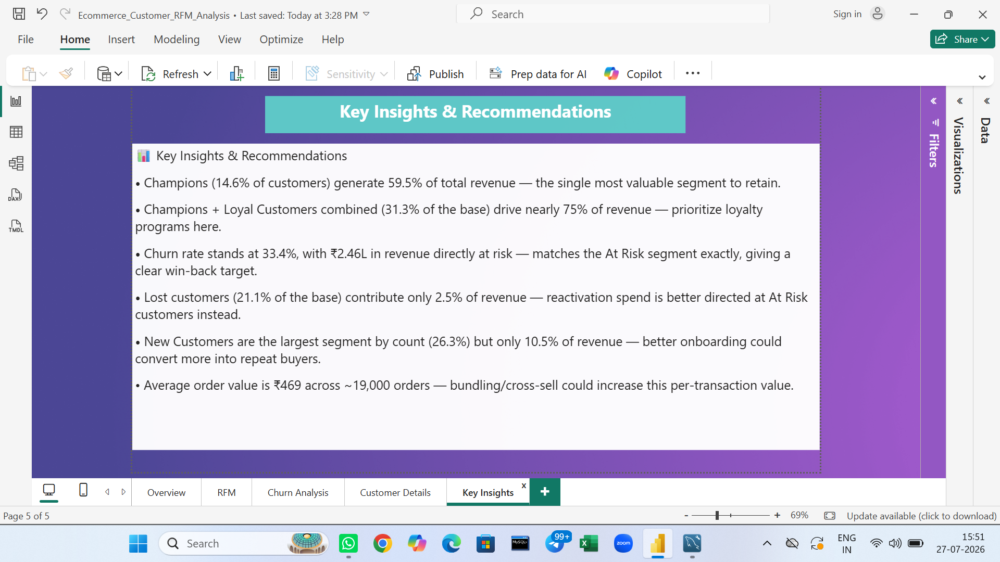

# E-Commerce Customer Analysis — RFM Segmentation Dashboard

An interactive Power BI dashboard analyzing e-commerce transaction data to segment customers using RFM (Recency, Frequency, Monetary) analysis, identify churn risk, and surface actionable business insights.

## 📊 Dataset
Source: [Online Retail II Dataset, Kaggle](https://www.kaggle.com/datasets/mashlyn/online-retail-ii-uci)
(~4,338 customers, ~19,000 orders, one year of UK-based e-commerce transactions)

## 🛠️ Tools Used
- Power BI Desktop (data modeling, DAX, visualization)
- Power Query (data cleaning and transformation)
- DAX (RFM scoring, segmentation logic, KPI measures)

## 📈 Dashboard Pages
1. **Overview** — Revenue trends, top products, top countries, KPI summary
2. **RFM Segmentation** — Customer segments (Champions, Loyal, At Risk, Lost, etc.), segment-level revenue and behavior
3. **Churn Analysis** — Churn rate, revenue at risk, active vs. churned customers
4. **Customer Details** — Drill-through page showing individual customer purchase history
5. **Key Insights** — Summary page translating RFM/churn findings into business recommendations

## 🔑 Key Insights
- **Champions alone (14.6% of customers) generate 59.5% of total revenue** (₹53L of ₹89.1L) — a highly concentrated customer base where retention is critical.
- **Champions + Loyal Customers (31.3% of the base) drive nearly 75% of revenue** — prioritizing loyalty programs for this group offers the highest ROI.
- **Churn rate is 33.4%, with ₹2.46L in revenue directly at risk** — this matches the At Risk segment's total value, providing a clear, actionable target for win-back campaigns.
- **Lost customers make up 21.1% of the base but contribute only 2.5% of revenue** — reactivation spend is better directed toward At Risk customers instead.
- **New Customers are the largest segment by count (26.3%) but only 10.5% of revenue** — signals strong acquisition but weak onboarding/retention; nurture campaigns could improve conversion to repeat buyers.
- **Average order value is ₹469 across ~19,000 orders** — bundling or cross-sell strategies could increase this per-transaction value.

## 📸 Screenshots

### Overview

### RFM Segmentation

### Churn Analysis

### Customer Details (Drill-through)

### Key Insights & Recommendations

## 📁 Files
- `Ecommerce_Customer_RFM_Analysis.pbix` — Full Power BI file (open in Power BI Desktop)
- Dataset not included due to file size — download from the Kaggle link above

## 👤 Author
Santosh — Aspiring Data Analyst
